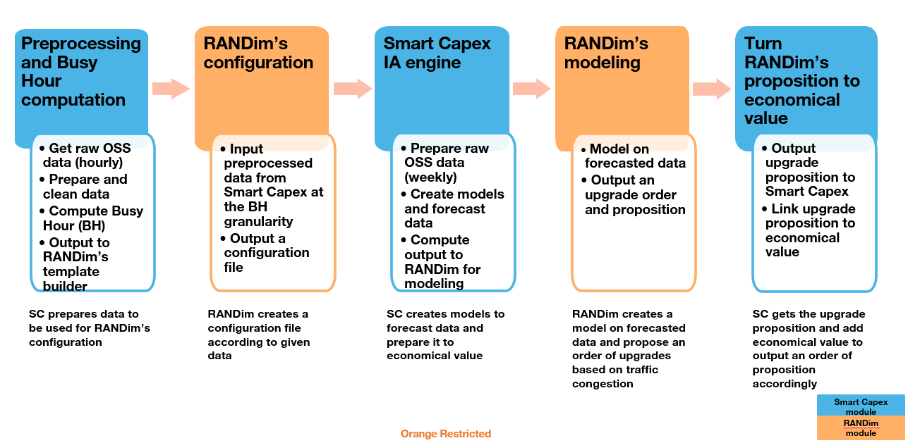

[](https://gitlab.tech.orange/smart-capex/smart-capex_tdd/-/commits/oma_dev)

 [](https://gitlab.tech.orange/smart-capex/smart-capex_tdd/-/commits/oma_dev)

 [](https://gitlab.tech.orange/smart-capex/smart-capex_tdd/-/releases)
# Smart Capex Density Module Delivery Documentation for OMA

## Table of Contents

- [Project Description](#project-description)
- [Tree Structure](#tree-structure)
- [Technical Pipeline](#technical-pipeline)
  - [Preprocessing](#preprocessing)
  - [Traffic Forecasting](#traffic-forecasting)
  - [Preparation of data for the new site proposition](#preparation-of-data-for-the-new-site-proposition)
  - [Get congestion and densification suggestion](#get-congestion-and-densification-suggestion)
  - [Traffic Improvement](#traffic-improvement)
- [Technical to Economical Pipeline](#technical-to-economical-pipeline)
- [Economical Pipeline](#economical-pipeline)
- [Installation from delivery package](#installation-from-delivery-package)
- [Installation from git repository](#installation-from-git-repository)
- [Sphinx Documentation](#build-sphinx-documentation)

## Project Description

The Density module is about optimizing capex investment related to capacity extension and coverage for OMA.


## Tree Structure
```
├── ./
    ├── .coveragerc
    ├── .env
    ├── .gitignore
    ├── .gitlab-ci.yml
    ├── .pre-commit-config.yaml
    ├── .pylintrc
    ├── analyze_ne.ipynb
    ├── Dockerfile
    ├── main_randim.py
    ├── README.md
    ├── README_test.md
    ├── requirements.txt
    ├── requirements_sphinx.txt
    ├── running_config.ini
    ├── sonar-project.properties
├── functional_documentation/
    ├── SmartCAPEX OMA_Densification_functional_documentation_v0.4.pptx
├── config/
        ├── delete_files.py
        ├── logging.dev.ini
├── src/
        ├── tdd_pipeline.py
        ├── __init__.py
    ├── d00_conf/
            ├── conf.py
            ├── fake_country_e2e.json
            ├── oma.json
            ├── oma_tdd.json
            ├── oma_test.json
    ├── d01_utils/
            ├── utils.py
            ├── utils_decorator.py
        ├── tests/
                ├── test_utils.py
    ├── d02_preprocessing/
            ├── conversion_rate.py
        ├── OMA/
                ├── build_site_dataset.py
                ├── preprocessing_hourly_oss.py
                ├── read_process_oss_counter.py
                ├── read_process_sites.py
        ├── tests/
                ├── data.py
                ├── data_preprocessing_hourly.py
                ├── test_conversion_rate.py
                ├── test_preprocessing_hourly_oss.py
                ├── test_read_process_oss_counter.py
    ├── d03_processing/
            ├── __init__.py
        ├── OMA/
                ├── output_to_bd.py
            ├── economical_modules/
                    ├── gross_margin_quantification.py
                    ├── npv_computation.py
            ├── new_site_modules/
                    ├── apply_new_site.py
                    ├── train_new_site.py
                ├── data_preprocessing/
                        ├── build_fdd_dataset.py
                        ├── build_voice_dataset.py
                        ├── data_processing.py
                        ├── data_source.py
                ├── models/
                        ├── target_site_prediction_fdd.py
                        ├── target_site_prediction_voice.py
                        ├── traffic_target_baseclass.py
            ├── technical_modules/
                    ├── apply_traffic_gain_densification.py
                    ├── arpu_quantification.py
                    ├── traffic_by_region.py
                    ├── traffic_forecasting.py
                    ├── traffic_improvement.py
                    ├── train_densification_impact_model.py
                    ├── __init__.py
            ├── tests/
                    ├── data.py
                    ├── data_output_to_bd.py
                    ├── df_predicted_traffic_kpis.csv
                    ├── test_output_to_bd.py
                    ├── test_sites_cells_preprocessing.py
                    ├── test_traffic_forecasting.py
                    ├── traffic_weekly_kpis.csv
    ├── d04_randim/
            ├── call_randim.py
        ├── tests/
                ├── test_call_randim.py
    ├── d06_api/
            ├── api.py
    ├── d08_docs/
            ├── make.bat
            ├── Makefile
        ├── pictures/
                ├── smart_capex_tdd_architecture.png
        ├── source/
                ├── conf.py
                ├── d00_conf.rst
                ├── d01_utils.rst
                ├── d02_preprocessing.rst
                ├── d03_processing.rst
                ├── index.rst
                ├── tdd_pipeline.rst
            ├── preprocessing/
                    ├── build_site_dataset.rst
                    ├── conversion_rate.rst
                    ├── preprocessing_hourly_oss.rst
                    ├── read_process_oss_counter.rst
                    ├── read_process_sites.rst
            ├── processing/
                    ├── economical_modules.rst
                    ├── new_site_modules.rst
                    ├── output_to_bd.rst
                    ├── technical_modules.rst
                ├── economical_modules/
                        ├── gross_margin_quantification.rst
                        ├── npv_computation.rst
                ├── new_site_modules/
                        ├── apply_new_site.rst
                        ├── data_preprocessing.rst
                        ├── models.rst
                        ├── train_new_site.rst
                    ├── data_preprocessing/
                            ├── build_fdd_dataset.rst
                            ├── build_voice_dataset.rst
                            ├── data_processing.rst
                            ├── data_source.rst
                    ├── models/
                            ├── target_site_prediction_fdd.rst
                            ├── target_site_prediction_voice.rst
                ├── technical_modules/
                        ├── apply_traffic_gain_densification.rst
                        ├── arpu_quantification.rst
                        ├── traffic_by_region.rst
                        ├── traffic_forecasting.rst
                        ├── traffic_improvement.rst
                        ├── train_densification_impact_model.rst
    ├── d10_experimental/
            ├── analyse_financial.py
            ├── paul_code.py
    ├── notebooks/
            ├── 20210201-pyspark example.ipynb
            ├── analyze_apply_model.ipynb
            ├── analyze_increase_arpu.ipynb
            ├── analyze_result_eco.ipynb
            ├── analyze_TDD_site_localisation.ipynb
            ├── display_densif_site_FDD.ipynb
            ├── incrase_new_site_densif.ipynb
            ├── increase_rate_new_site.ipynb
            ├── READMEtest.md
            ├── README_test.md
            ├── region_postpaid_prepaid.ipynb
            ├── shape_dataframe.ipynb
    ├── tests/
            ├── data_test.py
            ├── test_tdd_pipeline.py
├── tests/
        ├── test_main.py
```
## Technical Pipeline

This is the initial pipeline within the capacity module, comprising the following tasks:

1. **Oss Counters Preprocessing**
2. **Oss Counters Forecasting**
3. **Congestion Detection and Upgrade Selection**
4. **Traffic Improvement Computation**


### Preprocessing

This step includes the processing of various raw data files with different granularity (weekly/hourly) and different use case(TDD/FDD)
For weekly granularity we necessitate at least two years of historical data for integration into the forecasting model.
For Hourly granularity we necessitate at least 1 week of historical data for integration into the RANDim tool

### Traffic Forecasting

In this step, we forecast oss counters based on their historical values using facebook prophet algorithm.
Each (cell, KPI) will have an independent model.Thus the number of models is directly proportional to the both the number
of cells and the number of KPIs to forecast.

### Preparation of data for the new site proposition
**Predicted traffic KPIs (2 years) Compute_rate**: Enable us to project our hourly data to a period by calculating a ratio
from weekly data between historical data and the forecasted data at this period

**Congestion detection RANdim**: Use RANDim tool on our projected hourly data to find out the congested sites

**Densification proposition RANDim**: Use RANDim output to another RANDim request to get the densification proposition


### Get congestion and densification suggestion

**Data usage by RANDim**
We use RANDim tool for the congestion detection and then densification suggestion.

**Initialisation of RANDim tool**
We have a first interaction with RANDim tool where we give the hourly data at busy hour and RANDim result is a configuration file and our hourly data file rearange under RANDim format.

**Congestion Detection**
This file outputed by the first RANDim call is then project to a futur period with the ratio calculated from the weekly historical and forecasted data.
This projected hourly file is then give to RANDim to obtain the congestion of the network.


**Densification proposition**
This congestion file is given to a new RANDim request and give us as result the densification suggestions where we find the new site location and the nearly congested cells that need a new sites to decongest themself.


### Traffic Improvement

In the traffic improvement step, the objective is to estimate the traffic increase after
a band upgrade resulting previously from upgrade selection using a random forest algorithm.
To achieve this, we construct a training dataset based on the **previous upgrades on historical data**
containing multiple features such as variables: traffic before upgrade, bands before upgrade,
congestion KPI levels, etc. The goal is to predict the traffic after the upgrade,
which serves as the label.


## Technical to Economical Pipeline
The tech to eco pipeline is the second pipeline in capacity module. The objective of this pipeline is to compute
the increase in sites revenues due to upgrades.

## Economical Pipeline
The economical pipeline is the third and last one in capacity module. The objective of this pipeline is to compute
the net present values NPVs of upgrade actions that we propose in upgrade selection step.
To achieve this, we take into consideration the increase in sites revenues, capex and opex values along
with other economical parameters such as WACC.

## Installation from delivery package
After downloading and unzipping the `src.zip` Follow these steps to set up and run the project locally:
1. Ensure you have Python installed (version 3.6.8 recommended).
2. Install requirments:
    ```
   pip install -r requirements.txt
    ```
3. Run capacity module:
    ```
    python3 main.py
    ```
4. The tecnical documentation is available via this path:
```
technical_documentation/build/html/index.html
```

## Installation from git repository

Follow these steps to set up and run the project locally:

1. Ensure you have Python installed (version 3.6.8 recommended).
2. Clone the repository:
    ```
   git clone https://gitlab.tech.orange/smart-capex/smart-capex-tdd.git
    ```
3. Navigate to the project directory:
    ```
   cd smart-capex_tdd
    ```
4. Install requirments:
    ```
   pip install -r requirements.txt
    ```
5. Run Density module:
    ```
    python3 main_randim.py --path_to_country_parameters oma.json
    ```
    There is a paramater to pass (--path_to_country_parameters) the default parameter is **oma.json**
    But you can pass also different parameters. For an exemple a fake config file to launch unit test or
    end-to-end test (fake_country.json)

6. Work with running_config.ini

    To run density module there is some big sections (Traffic forecasting, tech-to eco,...). You can
     check the [running_config](running_config.ini) file. You can pass 3 values:
    * 0 to skip a step in preprocessing pipeline (return None)
    * 1 to read preprocessing pipeline step output file
    * 2 to execute the preprocessing pipeline step

## Sphinx documentation
You can find the existing documentation at this link: [Documentation](https://smart-capex-oeg-smart-capex-f17662dc8881e6f67af5262aac3a7f78837.pages.gitlab.tech.orange/)
or inside the repository in HTML format : [Documentation](technical_documentation/build/html)

But if you add some docstring in the code and you would modify the existing docs, you can follow these steps

### Modify Sphinx documentation

If you want to modify the sphinx documentation. You can modify:

1. Docstrings in source code
2. If you want to modify the structure of the documentation, you can go to the source folder [source](d04_docs/source) and modify the `.rst` files

You can then restart the documentation build with the following command

```
./d04_docs/make.bat html
```

## Explanation of the gitlab CI/CD file

We use Gitlab for the CI/CD of the project. To configure this pipeline we use the [.gitlab-ci.yml](.gitlab-ci.yml) file.

They are several parts to this file, which we'll explain briefly here.

* **Include**
  * This part is the most important because we use template for Orange for all different jobs : https://to-be-continuous.pages.gitlab.tech.orange/doc/ref/
  * *Python Template*: All jobs we need for python (Pylint, UnitTest, ....)
  * *Sphinx Template*: Template to build sphinx documentation
  * *Docker Template*: Template to build Docker Image andstock it in Gitlab: https://gitlab.tech.orange/smart-capex/smart-capex_tdd/container_registry
  * *Sonar Template*: Template to connect project with sonar instance: https://sqaas.dos.tech.orange/dashboard?branch=feature-paul-code-inclusion&id=smart-capex_smart-capex_tdd_AYWb2le9tRQKDMRUI7I9

* **variables**
  * In this part we can add or overrdie variable that can be utils for different job of template. For example
  * PYTHON_IMAGE
  * SONAR_HOST_URL
  * SPHINX_SOURCE_DIR
  * .....

* **stages**
  * Different stage of the pipeline
  * build
  * test
  * ......

* **jobs**
 * Then there are the different jobs.  These can be jobs that exist in the various templates, such as *py-pytest*
And they can also be jobs that don't exist in the templates, such as *pages* used to publish sphinx documentation.


## ToDo
- [ ] Preprocessing: We currently use capacity preprocessor files. We need to reintegrate the
      preprocessing part to build from the source files

- [ ] Conversion Rate: Check Code +  Unit test (Objective 80%)

- [ ] Forecasting : We currently use capacity forecasting files. We need to reintegrate the
      forecasting part to build forecast files.
- [ ] Traffic Improvement : Finish to build the model for new site and validate with Jules

- [ ] Applicate model to randim result : Verify code and clean up and standardize code

- [ ] Tech To Eco : Verify code and Result + Unit test (Objective 80%)

- [ ] Economic Pipeline : Verify code and Result + Create ANAFI for densification + Unit test (Objective 80%)

- [ ] Randim : Finish integrating authentication + Unit test (Objective 80%)

- [ ] Database : Integrate NPV in Database

- [ ] Adapt new end-to-end tests with Paul's Code
